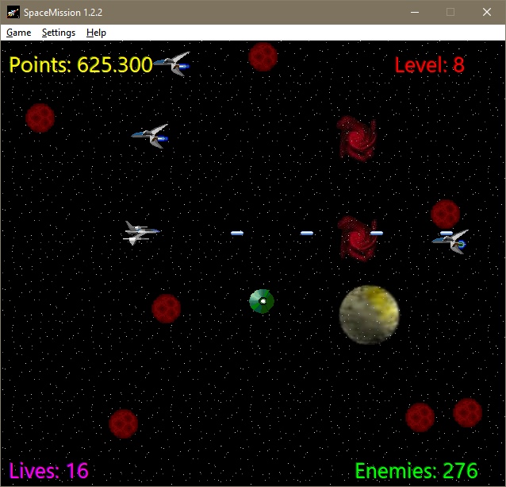
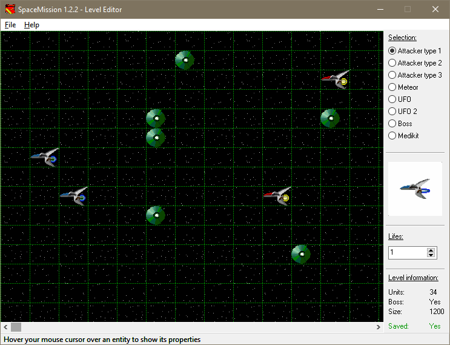

# SpaceMission

The game SpaceMission developed by Daniel Marschall is a simple space game, similar to Astroids or similar classics, in which you have to fly through a hail of comets and shoot down UFOs and other spaceships. It is equipped with a level editor and can also generation of random levels as well as 31 predefined levels. Despite the simple way of playing, the game is fun and easy to play, especially during short breaks.

SpaceMission, Version 1.0 was rated 90% by Gamer AG and was published in the magazines PC Games and Chip.

Licensed under the terms of the Apache 2.0 license.

## Screenshots

### Gameplay

### Level Editor

## Tools required for editing the source code

* Embarcadero Delphi 12 (Community edition available for non-commercial use)

* [Better Translation Manager](https://github.com/andersmelander/better-translation-manager/)
